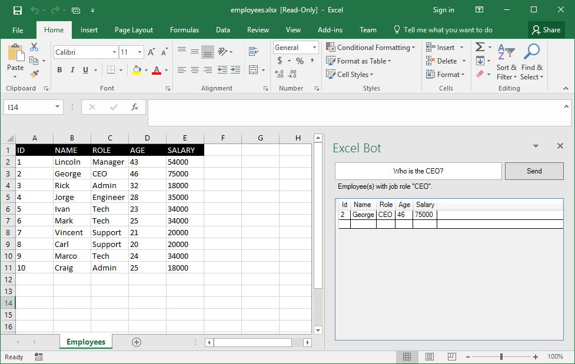

# Syn Bot Samples

This repository contains samples related to Syn Bot Development framework.

## 1. Natural Language Interface to Database

A demostration of how developers can use SIML or Oscova to create a natural language interface to database.

**Note:** Build both the projects in `Debug` mode.

### Oscova

The Oscova project contains all required Intents and design patterns to create custom Oscova Dialogs.

The project also demonstrates:

* Creating custom Entity Recognizers by reading through Database entries.
* Add Dialogs to the Bot
* Work with contextual intents
* Share data between different Intents.

### SIML

All example patterns are highlighted within the Examples tab. The database used in this demo application is reset to its initial value upon restart.

The knowledge-base of this project also implements an intelligent suggestion system to address queries that are very similar to existing patterns. Thereby teaching the user the right format of presenting questions to the Database.

### License

Projects under this repository are dual licensed under: MIT and [CPOL](http://www.codeproject.com/info/cpol10.aspx)

## 2. Oscova Android Bot

This project demonstrates the very basic concepts of creating an Android Bot in C# using Oscova.

### Watch the Tutorial on YouTube

## 3. Sample Oscova Bot

This is a sample App Bot developed using Oscova. You may download this repository to understand the basics covered in the Oscova tutorials section.

The project covers the following:

* Creating Dialogs
* Creating Intents
* Writing Expressions
* Entity Annotation

**Note:** Build the projects in `Debug` mode.

### Watch the Tutorial on YouTube

## 4. OSCOVA Excel Bot

This sample project demostrates incoporation of OSCOVA based bot directly within Office Excel via VSTA Add-In Project.

**Note:** Before running the project change the `excelFilePath` of the test Excel file (`employees.xlsx`). Please ensure that you build and Run the project in `Debug` mode.

### Basic Walkthrough

This project followed the following steps to add a Bot to Excel.

* Create a new `Excel 2013 and 2016 VSTO Add-in` project in **Visual Studio**.
* Add a new Windows Forums `UserControl` and name it `HostControl`. This control contains a `ElementHost` control that will contain the WPF based control. We chose this to keep the GUI as sleek as possible.
* Add a WPF `UserControl` and name is `BotControl` which will be contained within `ElementHost`.
* The data context of `BotControl` is backed by `BotViewModel` class.
* Create a function named `DisplayBotControl()` in `ThisAddIn.cs` file that will display the Bot control within the *Excel* sheet when the spreadsheet has loaded.
* The rest of the code structure is self-explanatory. Please browse through the sample project to learn more.

We will be refining and adding more information to this sample project via *comments*.

### Unloading from EXCEL

To remove the installed sample bot add-in from Excel after you have successfully tested the add-in, follow the steps below.

* Click on `File` and choose `Options`
* Select `Add-ins` and in the *Manage* drop-down option choose `COM Add-ins` and click **Go...**
* In the **COM Add-ins** dialog uncheck `OscovaExcelBot` and click **OK**
